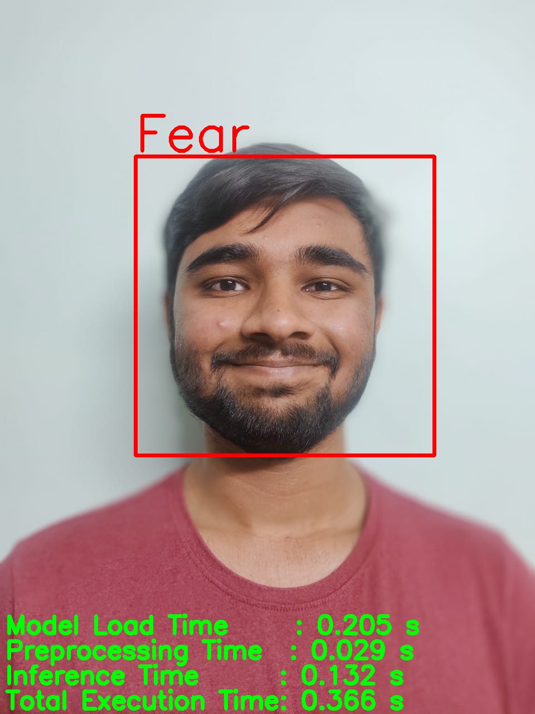
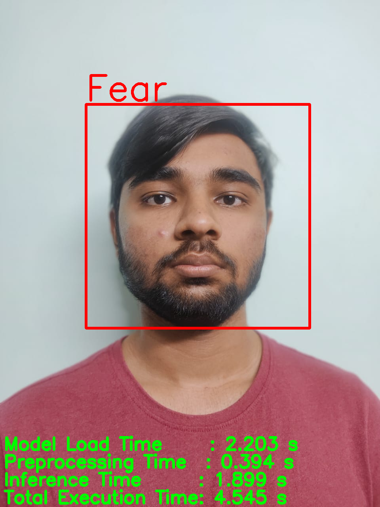
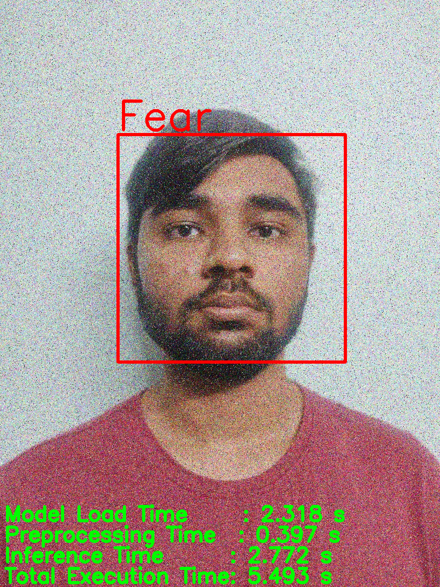
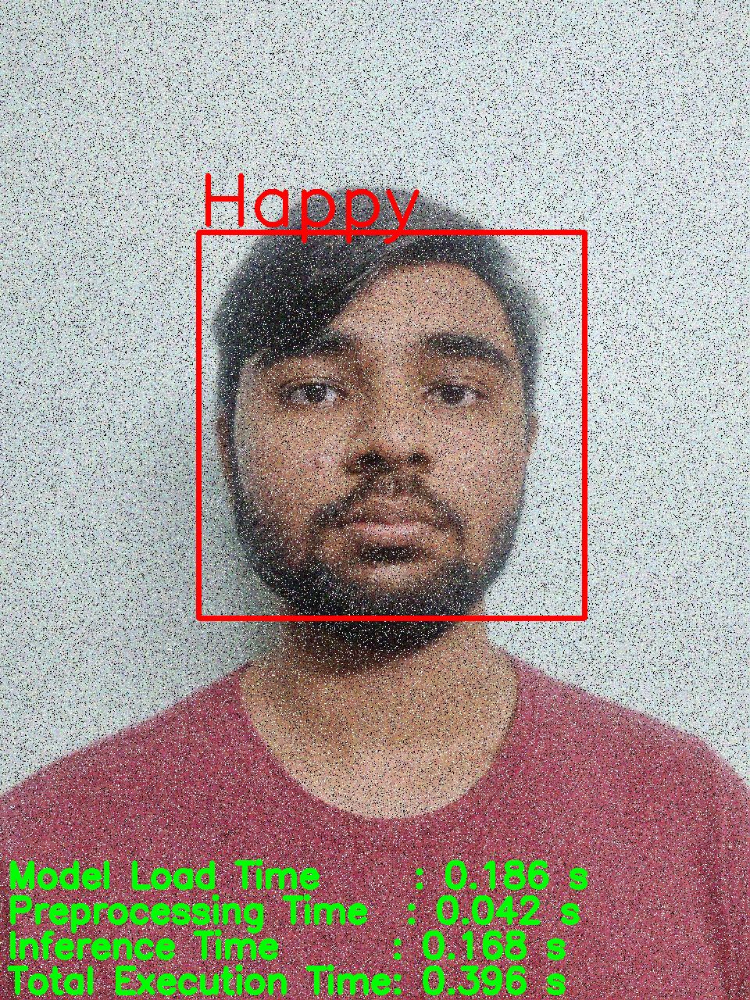
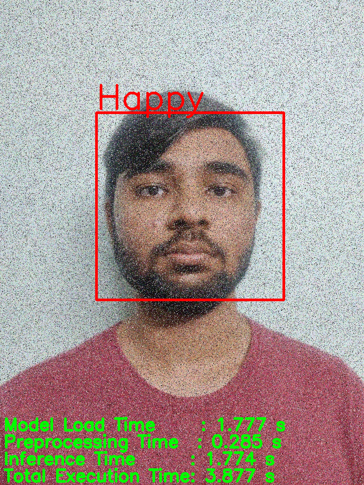
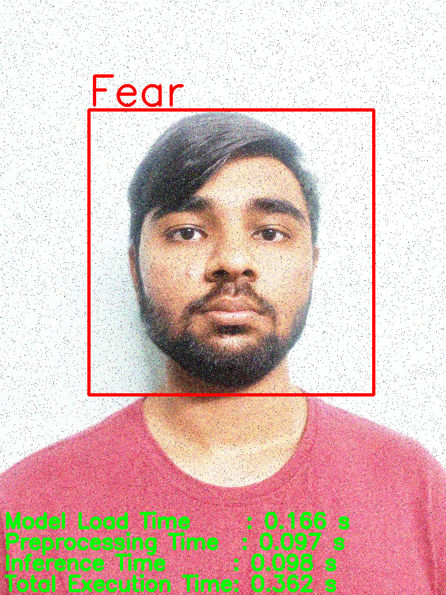

# ReSCNN-VA: Lightweight Sensor-Embedded CNN for Real-Time Valence-Arousal Regression and Emotion-Driven Music Recommendation

[](https://python.org)
[](https://pytorch.org)
[](LICENSE)
[](https://www.raspberrypi.org)

> **A lightweight CNN-based inference pipeline for real-time facial emotion recognition and emotion-aware music recommendation, optimized for embedded sensor deployment.**


*Proposed ReSCNN-VA system pipeline for emotion-aware music recommendation*

## 🚀 Overview

ReSCNN-VA presents a comprehensive framework that combines facial emotion recognition (FER) with continuous valence-arousal (VA) regression to enable real-time, personalized music recommendations. The system is specifically designed for deployment on resource-constrained embedded platforms while maintaining robust performance across various sensing conditions.

### Key Features

- **🎯 Dual Recognition**: Discrete emotion classification (7 categories) + continuous valence-arousal regression
- **⚡ Lightweight Architecture**: Only 2.6M parameters for emotion recognition, 1.8M for VA regression
- **🔧 Edge Deployment**: Optimized for Raspberry Pi 3 with real-time inference capabilities
- **🎵 Music Recommendation**: Emotion-aware personalized music selection with user feedback
- **🏃‍♂️ Real-time Processing**: Low-latency inference suitable for interactive applications
- **🔋 Power Efficient**: 5W total system power consumption during inference

## 📊 Training Results

### EmotionCNN Training Performance

| Training Configuration | FP32 | FP16 |
|------------------------|------|------|
| **Training Curves** |  |  |
| **Confusion Matrix** |  |  |
| **Final Accuracy** | 69.69% | 69.70% |
| **Model Size** | 27.35MB | 13.67MB |
| **Memory Usage** | ~1GB | ~512MB |

*Training performance comparison between FP32 and FP16 precision showing convergence behavior and classification accuracy across emotion categories.*

## 🏗️ System Architecture


*Comprehensive system architecture from facial input to music recommendation*

The framework consists of three main components:

1. **EmotionCNN**: Lightweight CNN for discrete emotion classification (Happy, Sad, Angry, Fear, Surprise, Disgust, Neutral)
2. **VA Regressor**: MobileNetV3-Small based model for continuous valence-arousal mapping
3. **Music Recommender**: Emotion-aware recommendation system with collaborative filtering

## 📁 Repository Structure

```
ReSCNN-VA/
├── .dist/                          # Distribution files
├── cpu_outputs/                    # CPU inference results and visualizations
│   ├── cpu_inference_fp32*.json   # Performance metrics
│   └── cpu_inference_fp32*.png    # Confusion matrices
├── gpu_outputs/                    # GPU inference results
├── images/                         # Documentation images and diagrams
├── preprocessing/                  # Data preprocessing utilities
├── rpi_outputs/                    # Raspberry Pi deployment results
├── RS/                            # Main recommendation system
│   ├── cpu_inference.py          # CPU inference pipeline
│   ├── gpu_inference.py          # GPU inference pipeline
│   ├── rpi_inference.py          # Raspberry Pi deployment
│   ├── config.py                 # Configuration settings
│   ├── recommend.py              # Music recommendation engine
│   └── convert_to_torchscript.py # Model conversion utilities
├── train_ECNN/                   # Emotion CNN training
│   └── scripts/
│       └── train_fp32_fp16.py    # Training script with mixed precision
├── VA_analysis/                  # Valence-Arousal analysis
│   └── scripts/
│       └── train_va.py          # VA regression training
└── README.md
```

## 🛠️ Installation

### Prerequisites

- Python 3.8 or higher
- PyTorch 1.9+
- OpenCV 4.5+
- NumPy, Pandas, Scikit-learn
- Spotify API credentials (for music features)

### Quick Setup

```bash
# Clone the repository
git clone https://github.com/yourusername/ReSCNN-VA.git
cd ReSCNN-VA

# Install dependencies
pip install -r requirements.txt

# Download pre-trained models
python scripts/download_models.py
```

### Raspberry Pi Setup

```bash
# Install PyTorch for ARM
pip install torch torchvision torchaudio --index-url https://download.pytorch.org/whl/cpu

# Convert model to TorchScript
python RS/convert_to_torchscript.py

# Run inference on RPi
python RS/rpi_inference.py
```

## 🚀 Quick Start

### Basic Emotion Recognition

```python
from RS.cpu_inference import EmotionInference

# Initialize inference pipeline
inferencer = EmotionInference(model_path="models/emotion_cnn.pth")

# Recognize emotion from image
emotion, va_coords = inferencer.predict("path/to/image.jpg")
print(f"Emotion: {emotion}, Valence: {va_coords[0]:.2f}, Arousal: {va_coords[1]:.2f}")
```

### Music Recommendation

```python
from RS.recommend import MusicRecommender

# Initialize recommender
recommender = MusicRecommender()

# Get emotion-based recommendations
songs = recommender.recommend_by_emotion(
    emotion="happy", 
    valence=0.8, 
    arousal=0.6, 
    user_id="user123"
)

for song in songs:
    print(f"{song['name']} by {song['artist']} - Match: {song['similarity']:.2f}")
```

### Real-time Webcam Demo

```python
# Run real-time emotion recognition with webcam
python RS/realtime_demo.py --source webcam --recommend
```

## 📚 Training

### Emotion CNN Training

```bash
cd train_ECNN/scripts/
python train_fp32_fp16.py --dataset fer2013 --epochs 100 --batch_size 64
```

### VA Regression Training

```bash
cd VA_analysis/scripts/
python train_va.py --dataset affectnet --epochs 50 --lr 0.001
```

## 🎯 Datasets

- **FER2013**: 35,887 samples for emotion classification
- **AffectNet**: 287,651 samples for valence-arousal regression
- **Custom Music Dataset**: Audio features from Spotify API

### Data Preprocessing

The framework includes comprehensive preprocessing:
- Gaussian filtering for noise reduction
- Image standardization to 48×48 resolution
- Class balancing through minority upsampling
- Data augmentation (rotation, flipping, color jittering)

## 🔬 Experimental Results

### Cross-Platform Performance Analysis

#### Execution Time Comparison

| Hardware Platform | Gaussian (50, 0.01, 1) | Impulse (25, 0.05, 1) | Illumination (25, 0.01, 1.5) |
|-------------------|-------------------------|------------------------|-------------------------------|
| CPU FP32 | 0.402s | 0.239s | 0.184s |
| GPU FP32 | 0.377s | 0.422s | 0.373s |
| GPU FP16 | 0.372s | 0.396s | 0.356s |
| RPi3 FP32 TS | 5.493s | 3.877s | 5.238s |

*TABLE 1. Execution time comparison of ECNN-VA model across different hardware platforms under various noise and illumination conditions. All times measured in seconds (s).*

#### Robustness Testing Visual Results

Comprehensive confusion matrix analysis across 12 different testing scenarios:

| Test Condition | CPU FP32 | GPU FP32 | GPU FP16 | RPi3 FP32 TS |
|----------------|----------|----------|----------|--------------|
| **Clean Images** |  |  |  |  |
| **Gaussian Noise (σ=50)** |  |  |  |  |
| **Impulse Noise (0.05)** |  |  |  |  |
| **Illumination (1.5x)** |  |  |  |  |

*TABLE 2. Confusion matrix visualization across different hardware platforms and testing conditions showing model robustness under various perturbations.*

## 🎵 Music Recommendation Features

### Mood Clustering

The system uses K-means clustering (k=4) to partition the VA space into distinct mood regions:
- **Happy** (High Valence, Moderate Arousal)
- **Energetic** (High Valence, High Arousal)  
- **Calm** (Moderate Valence, Low Arousal)
- **Sad** (Low Valence, Low Arousal)

### Recommendation Strategy

- **70% Mood-based**: Songs selected based on VA similarity
- **30% User History**: Collaborative filtering from user preferences
- **Adaptive Learning**: Continuous feedback integration
- **Multi-user Support**: Individual preference profiles

## 🤖 Edge Deployment

### Hardware Requirements

- **Minimum**: Raspberry Pi 3B+ (1GB RAM)
- **Recommended**: Raspberry Pi 4B (4GB RAM)
- **Camera**: Pi NoIR Camera Module or USB webcam
- **Storage**: 16GB microSD card

### Optimization Techniques

- **Model Quantization**: FP16 precision for GPU inference
- **TorchScript Conversion**: Optimized mobile execution
- **Memory Management**: Batch size optimization for constrained resources
- **Power Optimization**: Efficient inference scheduling

## 📈 Future Enhancements

- [ ] Temporal emotion modeling for video streams
- [ ] Hardware acceleration on Coral TPU/Jetson Nano
- [ ] Context-aware recommendations (time, location, activity)
- [ ] Large-scale user studies for demographic fairness
- [ ] Integration with additional sensor modalities

## 🤝 Applications

### Socially Assistive Technology

The framework is particularly designed for:
- **Healthcare Monitoring**: Real-time patient emotion tracking
- **Special Needs Support**: Adaptive interfaces for cognitive impairments
- **Educational Technology**: Engagement monitoring in learning environments
- **Driver Assistance**: Emotion-aware safety systems

